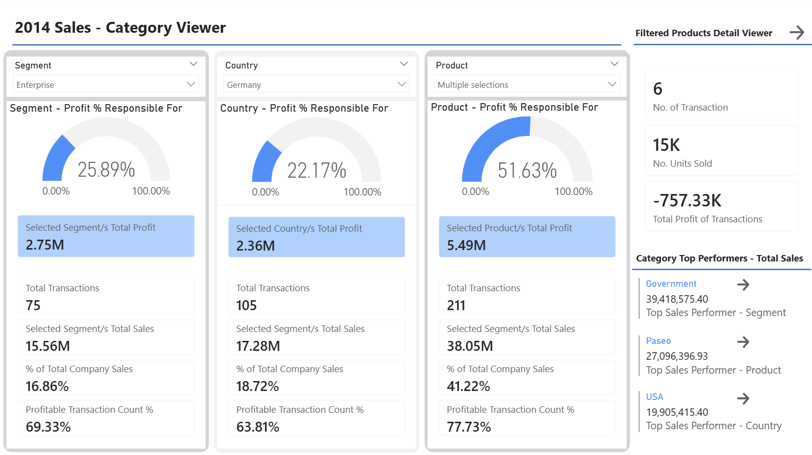
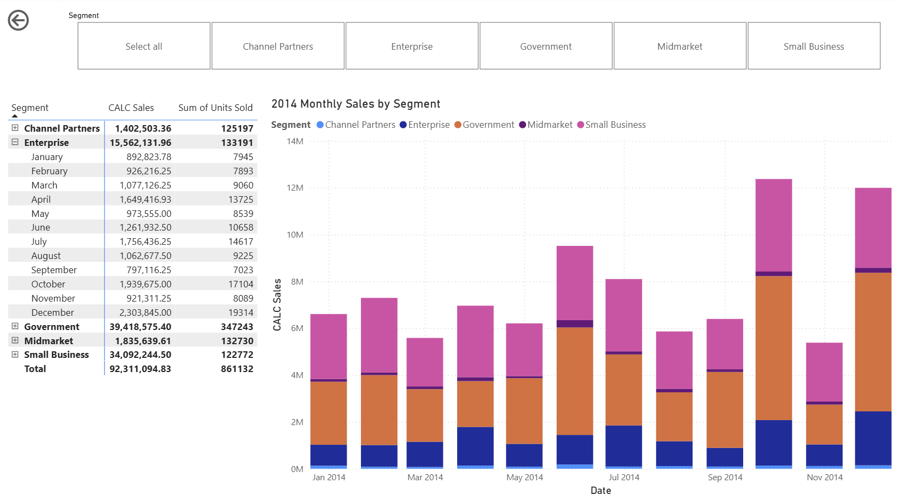
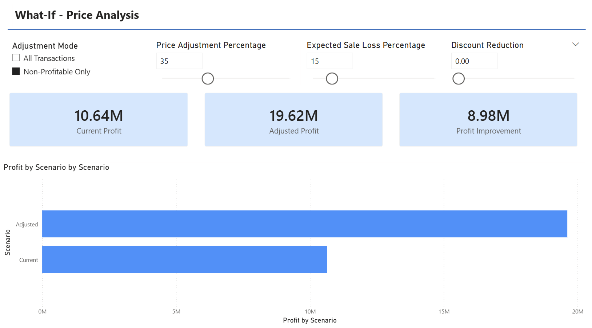
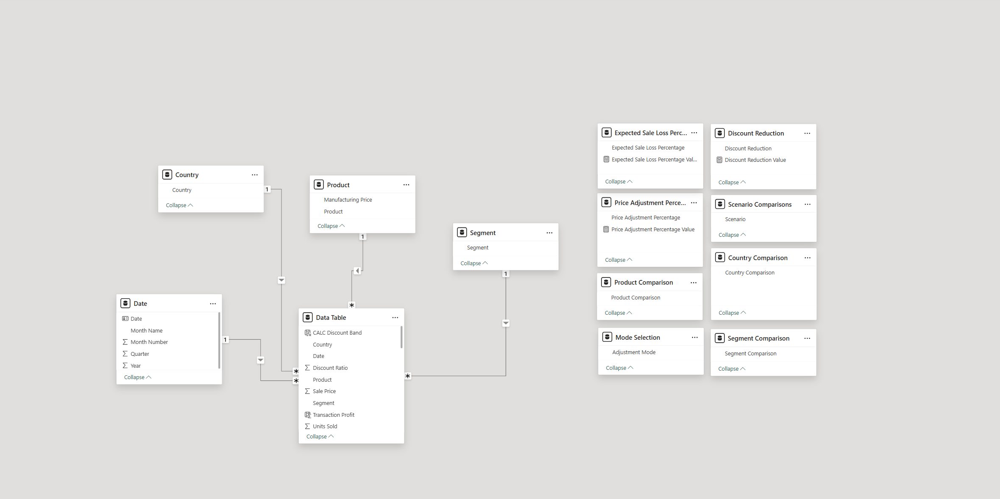

# Power BI Sales Analysis 📊

An advanced Power BI project demonstrating enterprise-level data modelling, DAX measure development, and interactive business intelligence reporting. Built independently as a self-taught Power BI project.

---

## Key Findings

- **$8.9M revenue recovery opportunity** identified from 174 unprofitable transactions
- Optimised data model reduced file size by **60%** using star schema architecture
- Interactive what-if analysis enabling price modelling across **6 products, 5 segments, and 6 countries**

---

## Dashboard Pages

### 1. Executive Summary

Overview of key KPIs: total revenue, profit margin, units sold

### 2. Sales Analysis

Breakdown by product, segment, and country with drill-through capability

### 3. What-If Price Modelling

Dynamic parameter sliders enabling scenario analysis across products and markets

---

## Data Model

### Star Schema Architecture
- **1 Fact Table:** Sales transactions
- **4 Dimension Tables:** Products, Customers, Geography, Date
- **Result:** 60% reduction in model size vs flat table



---

## DAX Measures (15+)

Key measures developed:

```DAX
-- Total Revenue
Total Revenue = SUMX(Sales, Sales[Units] * Sales[Sale Price])

-- Profit Margin %
Profit Margin % = DIVIDE([Total Profit], [Total Revenue], 0)

-- What-If Price Adjustment
Adjusted Revenue = 
    SUMX(
        Sales,
        Sales[Units] * Sales[Sale Price] * (1 + 'Price Adjustment'[Price Adjustment Value])
    )

-- Unprofitable Transactions
Unprofitable Count = COUNTROWS(FILTER(Sales, [Transaction Profit] < 0))
```

---

## Tech Stack


---

## Files

```
power-bi-sales-analysis/
├── sales_analysis.pbix     # Power BI report file
├── data/
│   └── Sample Sale data.xlsx     # Source data  
├── images/
│   ├── analysis_by_segment.png
│   ├── dashboard.png       
│   ├── model_view.png
│   └── what_if.png
└── README.md
```

---

## How to View

1. Download [Power BI Desktop](https://powerbi.microsoft.com/desktop/) (free)
2. Clone this repo
3. Open `sales_analysis.pbix`

---

## What I Learned

- Star schema design and why it outperforms flat tables
- Writing complex DAX measures (SUMX, CALCULATE, DIVIDE, FILTER)
- What-if parameter implementation for scenario analysis
- Identifying business insights from transaction-level data
- Self-teaching Power BI from scratch to production-quality output

---

*Part of my journey from Operations Manager to ML Engineer. Follow along on [Dev.to](https://dev.to/jemhrice)*
